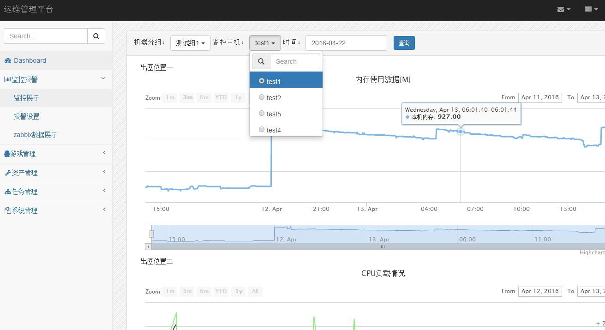
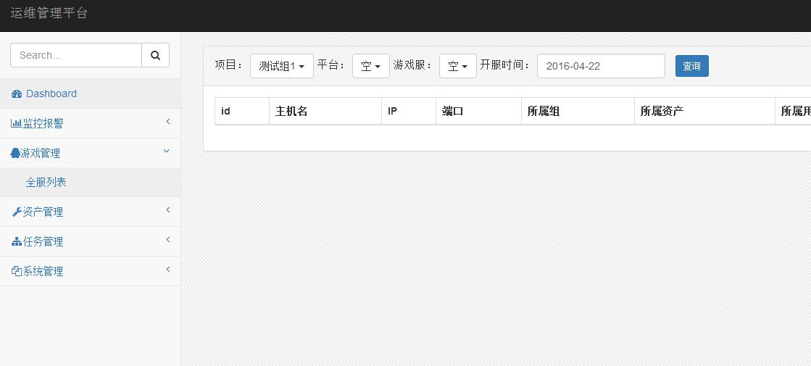
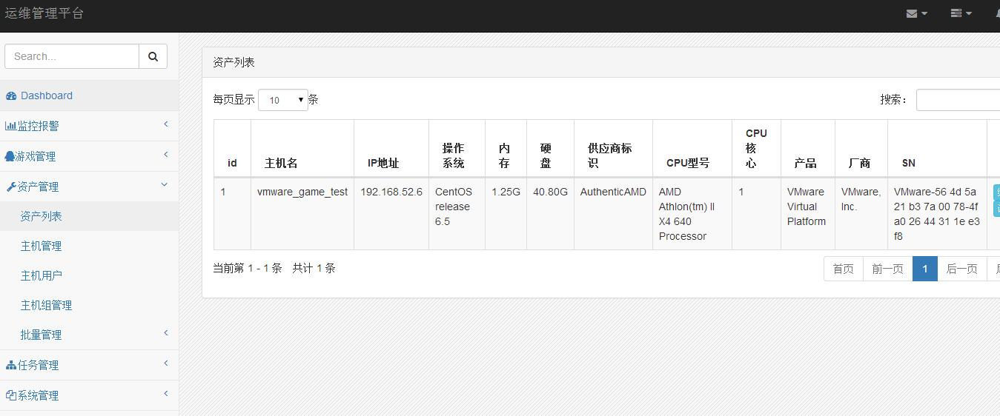
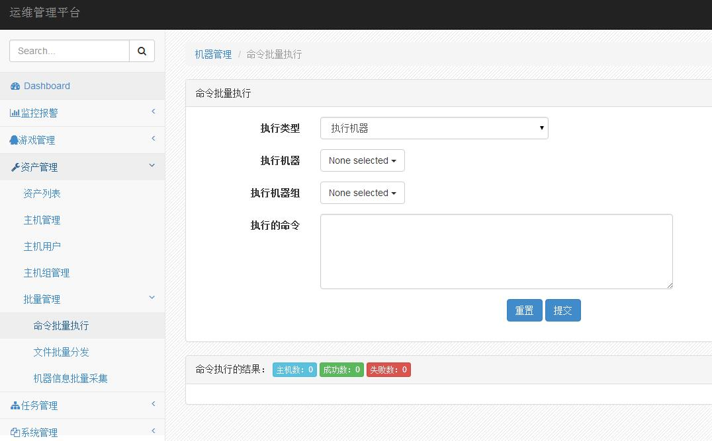
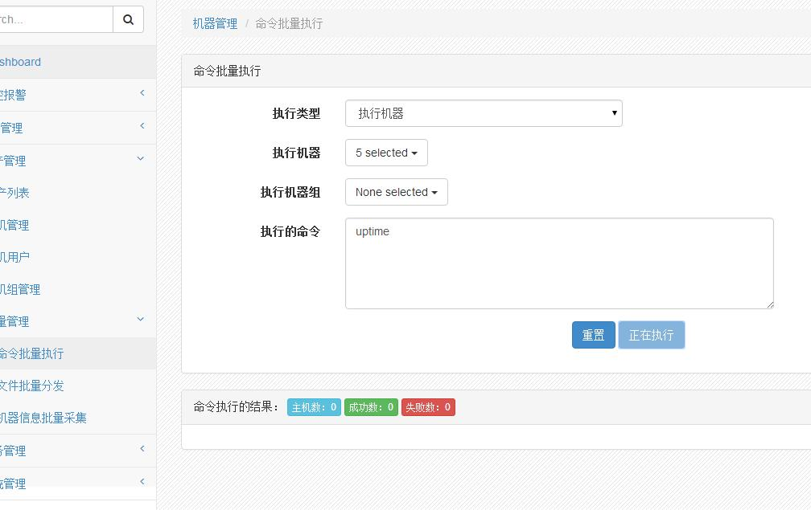
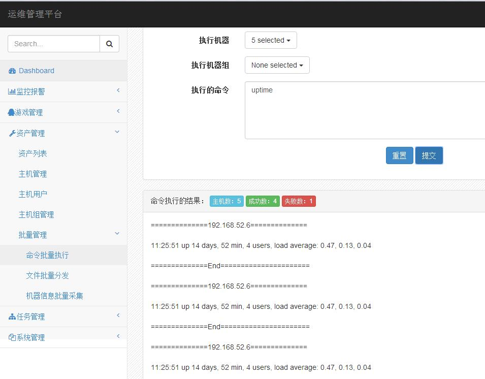
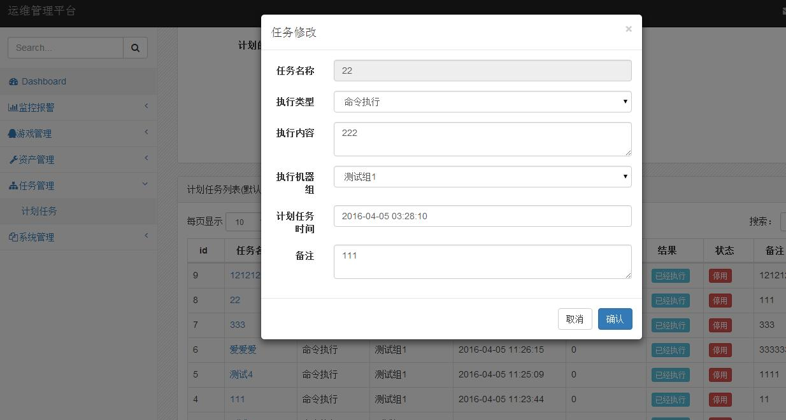
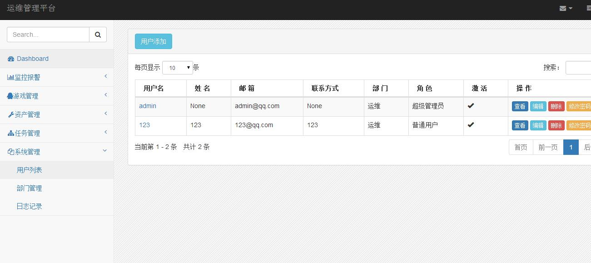
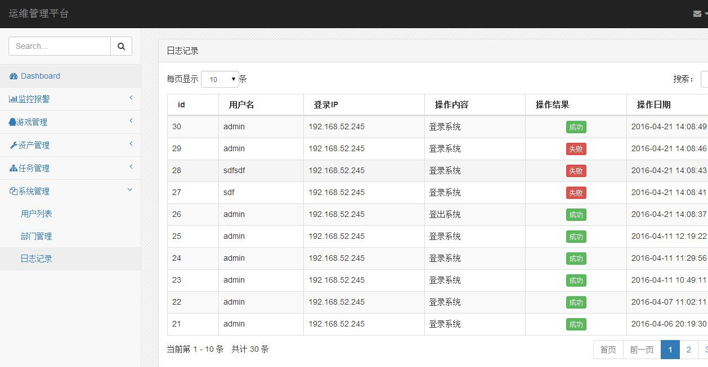

<html>
<body>
django_pro练习项目
主要功能包含监控报警，游戏管理，资产管理，任务管理，系统管理
AutoOps所需软件版本：django 1.9.4,python 2.7.11,前端bootstrap及jQuery v2.1.3,存储Mysql 5.5.25
图例如下
1,监控报警
 
2,游戏管理
 
3，资产管理
 
 
 
 
4，任务管理
 
5，系统管理
 
 
</body>
</html>
